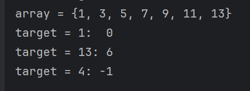

1) Бинарный поиск нельзя применять к неотсортированному массиву, т.к. при определении к какой половине относится искомое
число, мы отсекаем вторую половину, которая может содержать это искомое число.
2) Асимптотическая сложность алгоритма O(log n). Т.к. на каждом шаге мы отбрасываем половину данных, количество шагов,
необходимых для завершения поиска растет логарифмически от размера массива данных. На первом шаге искомая область
уменьшится до n/2, на втором шаге (n/2)/2 = n/2*2 и т.д.
3) Сложность по памяти будет O(1) - постоянная сложность, т.к. для поиска используются только три переменные left,
right, mid и их количество не изменится при увеличении размера массива. 

Вывод работы метода:

